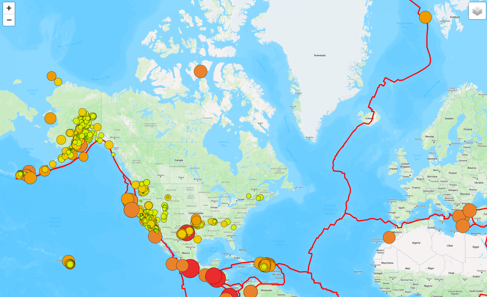

# Mapping Earthquakes with Leaflet and GeoJSON

## Purpose

Basil and Sadhana need a map of the world that shows every recent earthquake (from the past 7 days), as well as their relation to the tectonic plates. They would also like another overlay that shows only major earthquakes with a magnitude greater than 4.5. These will be color coded to be orange for a magnitude of 4.5 - 5, red for 5 - 6, and purple for greater than 6. Finally, they would like the map to have a dark style tile layer to be chosen from in the drop down. 

## Map

